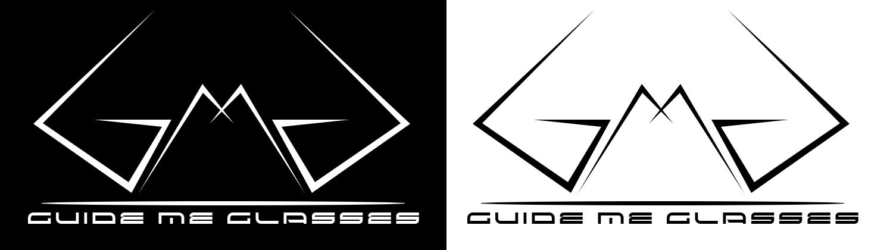
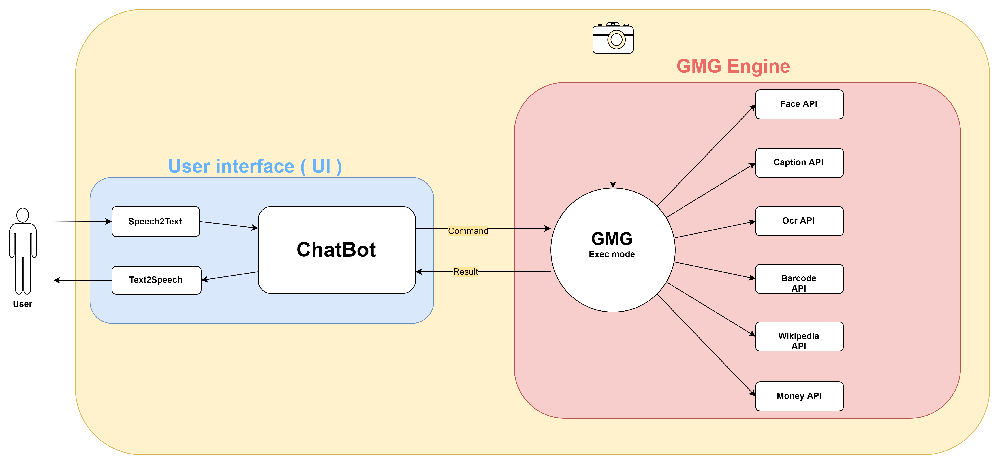
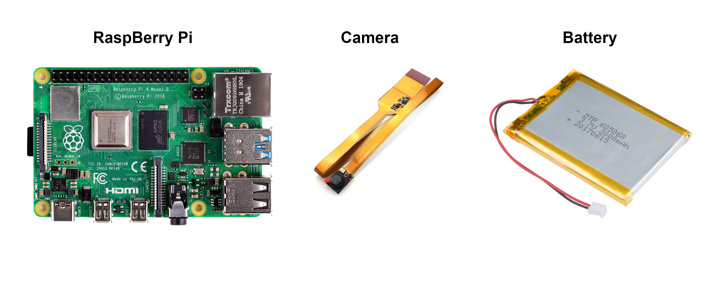

# :boom: Guide Me Glasses (GMG) :boom:
[](https://github.com/GuiltyNeuron/SmartGlasses/blob/master/LICENSE)
[](https://medium.com/@achraf_khazri/smart-glasses-project-1812392427d1)
[](https://www.python.org/downloads/release/python-355/)

> Bring the future to your eyes :eyeglasses:

This project is for goal to help blind people to read text, get informations from the net, identify people faces and describe pictures using semantic sentences.



## :construction_worker: Prototype architecture


## :hammer: Matriels


## :pencil: Usage

command options :
 - -t : task
 - -m : mode (opencv_haar, dlib_hog, dlib_cnn, mtcnn, mobilenet_ssd)
 - -i : input object (image path)
 - -l : language (en / fr)
 
#### 1) Face detection

```
python gmg.py -t face_detection -m opencv_haar -i image.png -l en
```
#### 2) Face recognition
Recognise person
```
python gmg.py -t face_recognition -i image.png -l en
```
Add person face to dataset
```
python gmg.py -t add_face -i image.png -l fr
```
Initialise dataset with the existing images
```
python gmg.py -t face_init
```

#### 3) Wiki api
Get informations about anything
```
python gmg.py -t wiki -i obama -l fr
```

#### 4) News api

Get latest 10 articles from CNN
```
python gmg.py -t news_latest -l en
```

Get by number (between 1 and 10) article from the latest articles published by CNN

```
python gmg.py -t news_article -i 3 -l en
```

#### 5) Weather api

Get the weather description for a specified city
```
python gmg.py -t weather -country canada -city vancouver -l en
```

#### 6) Time api

Get current date
```
python gmg.py -t date -l en
```

Get current time
```
python gmg.py -t time -l en
```

#### 7) Ocr api

Read text from input image
```
python gmg.py -t ocr -i image_path -l en
```

## :books: Documentation links
- Free computer science books [link](http://www.allitebooks.org/)
- Natural Language Processing (NLP) [link](https://github.com/KhazriAchraf/Text_Classification)
- Image caption [link](https://github.com/tensorflow/models/tree/master/research/im2txt)
- Face library Dlib github Readme file [link](https://github.com/ageitgey/face_recognition)
- Face detection and recognition Raspberry Pi [Link](https://www.pyimagesearch.com/2018/06/25/raspberry-pi-face-recognition/)
- Open source ChatBot library [Link](https://rasa.com)

## Licence
GuideMeGlasses
:eyeglasses:
