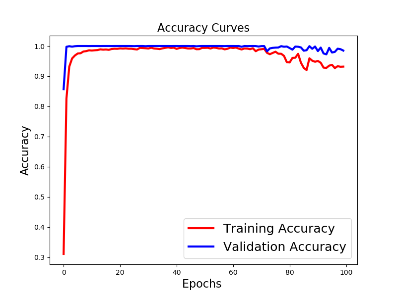
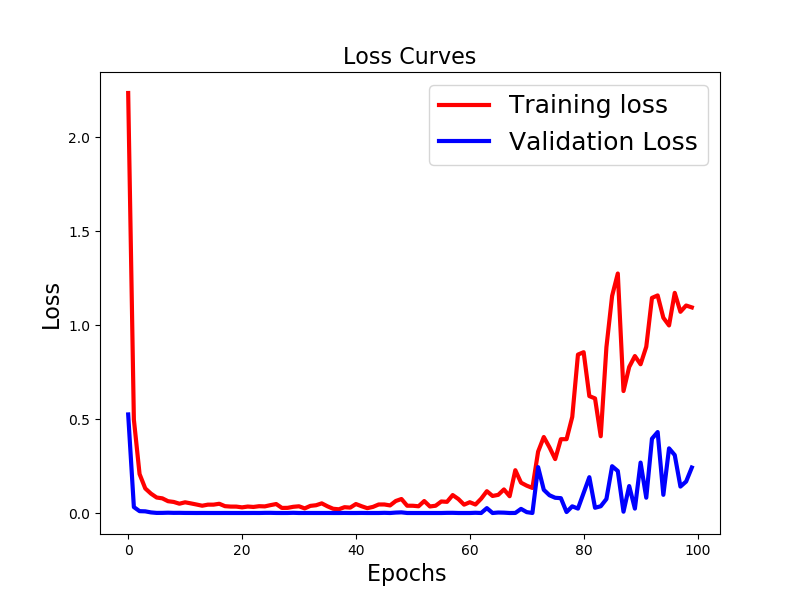

# :ok_hand: Hand Sign API

## Introduction
This API is responsible of detecting human hand then recognise the sign if exists.
For the detection, we are going to train one of those model : Faster RCNN, SSD or YOLO.
And for the recognition, we are going to use and train a CNN model.

## Results
##### CNN sign classifier training :
 

## :books: Documentation
- Dataset links for detector [link1](http://vision.soic.indiana.edu/projects/egohands/), [link2](https://sites.google.com/view/11khands)
- Dataset link for sign classification [Link](https://www.kaggle.com/datamunge/sign-language-mnist)
## Licence
GuideMeGlasses
:eyeglasses: