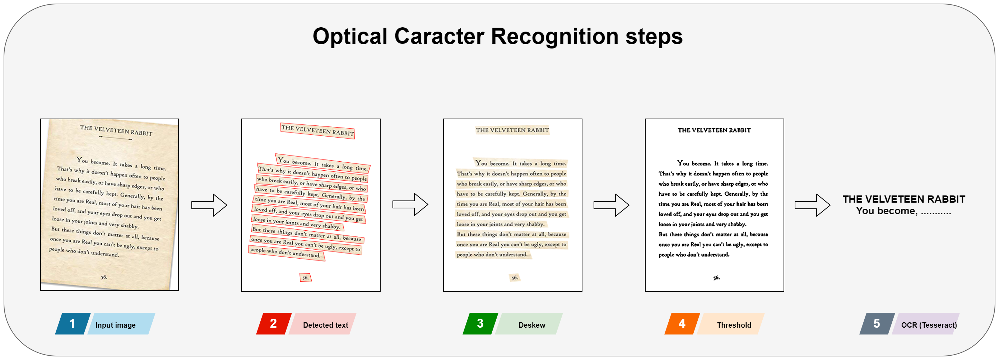

## :clipboard: Ocr API

#### Introduction
Text detection from real scene :
 - CTPN detector
 - EAST detector
 
Text recognition :
 - Tesseract engine

#### Pipeline

Steps to extract text from image :
- Step 1 : Read image
- Step 2 : Detect text
- Step 3 : Deskew text
- Step 1 : Thresholding
- Step 1 : OCR using Google Tesseract

## :books: Documentation
- Text detectors DNN : [Link](https://github.com/hwalsuklee/awesome-deep-text-detection-recognition)
- Text detection from real scene CTPN dnn detector : [Link](https://github.com/eragonruan/text-detection-ctpn)
- Text detection from real scene EAST dnn detector : [Link](https://github.com/argman/EAST)
- Text recognition using Google Tesseract Engine : [Link](https://github.com/tesseract-ocr/tesseract)

## Licence
GuideMeGlasses
:eyeglasses: